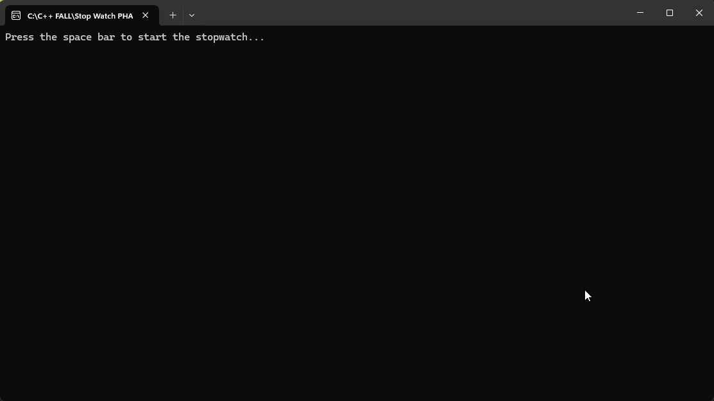

# Console Stopwatch

A clean and simple C++ console-based **stopwatch** with lap tracking and a fun animated timer. Built using object-oriented principles for clarity and organization.

## Features
    Neat console timer animation,
    Lap feature to view split times,
    Millisecond precision timing,
    Organized object-oriented structure,
    Easy to read and visually appealing output.

## How to Run

Using Visual Studio:

1. Open the solution file `Stopwatch.sln` in Visual Studio.
2. Build the project.
3. Run it in Debug or Release mode.

> ✅ No need to copy and paste any files — just open and run the solution!

## Demo Output

